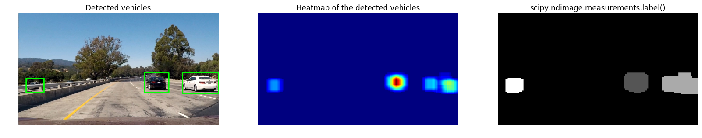

##Writeup Template
---

**Vehicle Detection Project**

The goals / steps of this project are the following:

* Perform a Histogram of Oriented Gradients (HOG) feature extraction on a labeled training set of images and train a classifier Linear SVM classifier
* Perform color transform and append binned color features, as well as histograms of color, to your HOG feature vector. 
* Normalize features and randomize a selection for training and testing.
* Implement a sliding-window technique and use your trained classifier to search for vehicles in images.
* Run pipeline on a video stream (start with the test_video.mp4 and later implement on full project_video.mp4) and create a heat map of recurring detections frame by frame to reject outliers and follow detected vehicles.
* Estimate a bounding box for vehicles detected.

---
Special Thanks to Milutin Nikolic, reference to his work as suggested by mentor in past project helped me improve performance of my code and also helped me with new ideas achieving targets.

###Histogram of Oriented Gradients (HOG)

####1. Explain how (and identify where in your code) you extracted HOG features from the training images.

The code for this step is contained in the first code cell 175 & 105 of the IPython notebook. HOG is calculated on all 3 channel of downscaled image with color space - LUV. As suggested in training notes, HOG is computed only once per image and it was further used on sub-samples region of images.  

I started by reading in all the `vehicle` and `non-vehicle` images.  Here is an example of one of each of the `vehicle` and `non-vehicle` classes:

I then explored different color spaces and different `skimage.hog()` parameters (`orientations`, `pixels_per_cell`, and `cells_per_block`).  I grabbed random images from each of the two classes and displayed them to get a feel for what the `skimage.hog()` output looks like.

Here is an example using the `LUV` color space and HOG parameters of `orientations=8`, `pixels_per_cell=(8, 8)` and `cells_per_block=(2, 2)`:

####2. Explain how you settled on your final choice of HOG parameters.

I tried various combinations of parameters as demostrated in Cell 105 and post trail 128 bins, orientation 8, prixels/cell=8 and cells per block 2 gave me the best result.

####3. Describe how (and identify where in your code) you trained a classifier using your selected HOG features (and color features if you used them).

I trained a SVM (Linear) as show in cell 123. It was trained on test data provided by Udacity with Accuracy Score of 99.72. Features were extracted using HOG, Color and Spatail Bins. 

Results:
Reading Data from Sub Directory:  GTI_Far
Reading Data from Sub Directory:  GTI_Left
Reading Data from Sub Directory:  GTI_MiddleClose
Reading Data from Sub Directory:  GTI_Right
Reading Data from Sub Directory:  KITTI_extracted
Reading Data from Sub Directory:  Extras
Reading Data from Sub Directory:  GTI

Accuracy Score 0.997184684685

###Sliding Window Search

####1. Describe how (and identify where in your code) you implemented a sliding window search.  How did you decide what scales to search and how much to overlap windows?

I followed farthest and nearest scaling concept shared during training, i.e. nearest scope to have bigger sizes window, and window sizes to be trimmed as it approaches horizon. I also studied many blogs how people have implemented it, I liked approach by Milutin to pre-define multiple scale region of interest and later be scanned for vehicle detection on the same. In total six scales has been used for scanning.

Below is the sample demonstrating on various scales come in play while scanning. 

####2. Show some examples of test images to demonstrate how your pipeline is working.  What did you do to optimize the performance of your classifier?

Below optimizations helped me achieve better results with minimum false positives:
1. Color Space Choice as LUV, instead of YCrCb
2. Combining HOG, with Color and Spatian Bin than just trying alone HOG.
3. Spatial Bin Size from 64 to 128. 

Sample of output is as listed below:

---

### Video Implementation

####1. Link to your final video output.

####2. Describe how (and identify where in your code) you implemented some kind of filter for false positives and some method for combining overlapping bounding boxes.

I recorded the positions of positive detections in each frame of the video.  From the positive detections I created a heatmap and then thresholded that map to identify vehicle positions.  I then used `scipy.ndimage.measurements.label()` to identify individual blobs in the heatmap.  I then assumed each blob corresponded to a vehicle.  I constructed bounding boxes to cover the area of each blob detected.  

Samples Images:

---

###Discussion

####1. Briefly discuss any problems / issues you faced in your implementation of this project.  Where will your pipeline likely fail?  What could you do to make it more robust?

1. Detection Failures and False-Positives: My intial attempt was without using scaling window scanning, there were lot of false positives and I had trouble finding either big cars, post adding scaling windows, it helped improved accuracy of scan.
2. Smoothning of bounding boxes, bounding boxes are bit jumpy, it is probably because of slow machine power & also an oportunity to possibly optimize code further.
3. I feel that training has challenge with high intensity whites, it may be worth trying data augmentation and re-training. And also use Neural Networks to see if that helps with accuracy. 

